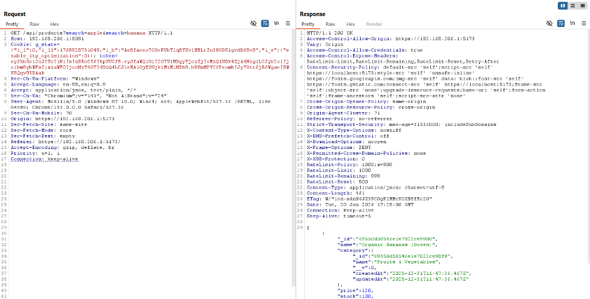
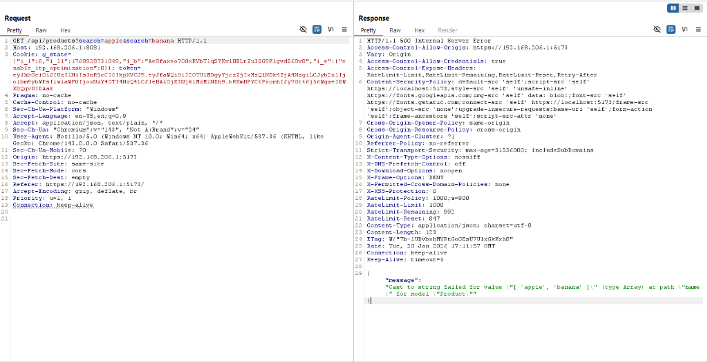

# Nepali Grocery Store 🛒
A full-stack e-commerce application for grocery shopping, featuring a robust and secure backend. Built with the **MERN stack** (MongoDB, Express, React, Node.js).

---

## 🛠️ Tech Stack
*   **Frontend:** React (Vite), TailwindCSS, Axios
*   **Backend:** Node.js, Express.js
*   **Database:** MongoDB, Mongoose
*   **Payment:** eSewa Integration
*   **Security:** Rate-Limit, BCrypt, JWT (HttpOnly), GeoIP-Lite, XSS (Sanitization), Helmet

---

## 🛡️ Security Architecture: The "HttpOnly" Advantage
We have engineered the authentication system to be resilient against modern web attacks. We prioritized security by moving away from `localStorage` to **HttpOnly Cookies**.

### 1. LocalStorage vs. HttpOnly Cookie 🥊
| Feature | LocalStorage (The "Unsafe" Way) | HttpOnly Cookie (The "Secure" Way) |
| :--- | :--- | :--- |
| **Accessibility** | Accessible by ANY JavaScript code running on the page. | **NOT Accessible** by JavaScript. Only the browser reads it. |
| **Attack Scenario** | Hacker script runs `localStorage.getItem('token')` -> **Stolen!** | Hacker script runs `document.cookie` -> **Empty!** (Token is hidden). |
| **Transport** | Must completely manually attach to headers (`Authorization: Bearer...`). | **Browser automatically** attaches it to requests. |

### 🔍 Code Implementation (`userController.js`)
```javascript
// Setting the Secure Cookie
res.cookie('token', token, {
    httpOnly: true,  // 🔒 JS cannot read this
    secure: process.env.NODE_ENV === 'production', // true in prod
    sameSite: process.env.NODE_ENV === 'production' ? 'none' : 'lax', // CSRF protection
    maxAge: 7 * 24 * 60 * 60 * 1000 // 7 Days
});
```

### 2. Deep Dive: How It Works (Q&A) 🧐
1.  **Is the cookie set in the backend?** YES. Use `res.cookie('token', token, { httpOnly: true })`. This instructs the browser to save the token specially.
2.  **Can the frontend read the cookie?** **NO.** This is the key feature.
    *   The Browser manages the cookie in a secure "Cookie Jar".
    *   **JavaScript** (react code, console, or malicious scripts) **CANNOT** read it. `document.cookie` returns an empty string.
    *   The browser automatically attaches the cookie to every request to the backend, so the server knows who you are, but the frontend code doesn't need to know.
3.  **Does this prevent Session Hijacking?** **YES.**
    *   **The Attack:** A hacker injects a script to steal your `localStorage` or `document.cookie`.
    *   **The Defense:** Since the cookie is **HttpOnly**, the hacker's script sees nothing. They cannot steal the token. They cannot impersonate the user on their own machine.

---

## 🦠 Understanding XSS Types: The Three Attack Vectors
Since we defend against XSS, it is important to understand all three types:

| Type | Stored XSS | Reflected XSS | DOM XSS |
| :--- | :--- | :--- | :--- |
| **Where it lives** | **Database**. Hacker posts a bad comment. | **URL/Request**. Hacker sends a link like `site.com?q=<script>...` | **Browser Memory**. Frontend code unsafely manipulates the DOM. |
| **Mechanism** | Server saves the script and serves it to every visitor. | Server echoes the malicious input back in the response (e.g., search results page). | Frontend takes input and puts it into `innerHTML` without sanitization. |
| **Persistence** | Permanent. Stays in DB until removed. | Temporary. Only affects users who click the malicious link. | Temporary. Happens purely client-side. |
| **Danger Level** | **High**. Can infect thousands. | Medium. Requires social engineering. | Medium. Requires vulnerable frontend code. |
| **Example** | Comment: `<script>steal()</script>` saved to DB. | URL: `site.com/search?q=<script>alert('XSS')</script>` | Code: `div.innerHTML = userInput` (without escaping). |
| **Our Defense** | **Backend Sanitization (`xss`)** + React escaping. | Input validation + React escaping. | React's architecture + **HttpOnly Cookies**. |

### 🧼 Backend Data Sanitization (Layer 3 Defense)
To ensure **Stored XSS** never happens, we implemented a global sanitization middleware using the `xss` library.

*   **Intercepts:** Every request (`req.body`, `req.query`, `req.params`) is checked.
*   **Actively Cleans:** It strips out dangerous tags (e.g., `<script>`, `<onload>`, `<iframe>`).
*   **Result:** Even if a malicious user tries to send `<b><script>alert(1)</script></b>`, the Backend converts it to `<b>alert(1)</b>` before it ever touches the database.

**Actual Code (`middleware/cleanInput.js`):**
```javascript
export const cleanInput = (req, res, next) => {
    try {
        if (req.body) req.body = sanitizeObject(req.body);
        if (req.query) {
            const cleanedQuery = sanitizeObject(req.query);
            for (const key in cleanedQuery) req.query[key] = cleanedQuery[key];
        }
        next();
    } catch (error) { ... }
};
const sanitizeObject = (data) => {
    if (typeof data === 'string') return xss(data); // The core magic happens here 🧼
    if (typeof data === 'object' && data !== null) {
        for (const key in data) data[key] = sanitizeObject(data[key]);
    }
    return data;
};
```

### 🧼 Frontend Sanitization (Layer 4 Defense)
We use **DOMPurify** in React components where we must render HTML dynamically (e.g., Chatbot responses).
*   **Why?** React's `dangerouslySetInnerHTML` is, well, dangerous.
*   **Solution:** We wrap any HTML content in `DOMPurify.sanitize()` before passing it to React. This ensures that even if the backend missed something, the browser will refuse to execute scripts inside that specific block.

**Actual Code (`Chatbot.jsx`):**
```javascript
<p className="text-sm whitespace-pre-wrap" 
   dangerouslySetInnerHTML={{ 
       __html: DOMPurify.sanitize(msg.text.replace(/\*\*(.*?)\*\*/g, '<strong>$1</strong>')) 
   }}>
</p>
```

---

## 🔐 Advanced Security Implementations

### 1. Authentication & Access Control
*   **Dual-Token System:** Supports both HttpOnly cookies (browser) and Bearer tokens (mobile/API).
*   **Rate Limiting:** IP Blocked after **10 failed attempts** in 10 mins. Returns `429 Too Many Requests`.
*   **Captcha Verification:** Server-side Google ReCAPTCHA checks to stop bot logins.
*   **Secure Email:** Prevents enumeration attacks during email updates.
*   **Smart Password Policies (NEW):**
    *   **Name Ban:** Passwords cannot contain your name (e.g., "Dipendra" cannot use "Dipendra123").
    *   **Anti-Reuse History:** You cannot reuse any of your last **5 passwords**.
    *   **Expiration Warning:** If your password is >30 days old, the system warns you to update it.

**Actual Code (`userController.js`):**
```javascript
// 1. Name Check: Password cannot contain user's name
const nameParts = user.fullName.toLowerCase().split(' ');
const isNameInPassword = nameParts.some(part => part.length > 2 && password.toLowerCase().includes(part));
if (isNameInPassword) throw new Error("Password cannot contain your name.");

// 2. History Check: Cannot reuse last 5 passwords
for (const oldHash of user.passwordHistory) {
    if (await bcrypt.compare(password, oldHash)) {
        throw new Error("You cannot reuse a recent password.");
    }
}
```

### 2. Logging & Monitoring (Winston) 🪵
We replaced standard `console.log` with **Winston** for production-grade logging.
*   **Persistence:** Logs are saved to files in `server/logs/`, unlike console logs which vanish on restart.
*   **Daily Rotation:** We use `winston-daily-rotate-file` to generate a fresh log file every day (e.g., `2026-01-09-audit.log`).
*   **Three-Layer Categorization:**
    *   `*-error.log`: **Critical Crashes** (Status 500). Needs immediate dev attention.
    *   **`*-audit.log`**: **Security Alerts** (Status 401, 403, 429). Warns about Brute Force or unauthorized access.
    *   `*-access.log`: **General Traffic** (Status 200). Used for analytics and debugging paths.
*   **Security:**
    *   **Sanitization:** The logger automatically redacts sensitive fields like `password` or `token` from the logs.
    *   **GitIgnore:** The `logs/` folder is excluded from GitHub to prevent data leakage.

**Actual Code (`utils/logger.js`):**
```javascript
new winston.transports.DailyRotateFile({
    filename: 'logs/%DATE%-audit.log',
    datePattern: 'YYYY-MM-DD',
    level: 'warn',
    maxFiles: '90d' // Keep logs for 90 days
})
```

### 3. Helmet (Secure Headers) ⛑️
We use **Helmet** to secure our HTTP headers. It is a collection of 14 small middleware functions that set security standards.
*   **Hides Tech Stack:** Removes the `X-Powered-By: Express` header so hackers don't know what backend we are using.
*   **Anti-Clickjacking:** Sets `X-Frame-Options: SAMEORIGIN` to prevent your site from being embedded in a malicious iframe.
*   **Anti-Sniffing:** Sets `X-Content-Type-Options: nosniff` to stop browsers from trying to guess ("sniff") the MIME type, which usually leads to XSS.
*   **Strict Transport Security (HSTS):** Forces browsers to use HTTPS (if configured).

**Actual Code (`server.js`):**
```javascript
import helmet from "helmet";
app.use(helmet()); 
```

### 4. Google OAuth Security
*   **Account Takeover Prevention:** We strictly check `email_verified: true` from the Google ID Token. We ignore client-side claims.
*   **Role Escalation:** New Google users are hardcoded to `role: 'normal'`. The controller ignores any `role` parameter in the request body.
*   **Secure Merging:** Allows Google Sign-In to link with existing email accounts only because we trust Google's verification.

**Actual Code (`userController.js` logic):**
```javascript
const ticket = await client.verifyIdToken({ idToken, audience: CLIENT_ID });
if (!ticket.getPayload().email_verified) throw new Error("Email not verified");
```

### 5. Admin Security (RBAC)
*   **Middleware Protection:** All `/api/admin/*` routes are guarded by `isAdmin`. Non-admins get `403 Forbidden`.
*   **Audit Logging:** Critical actions (Delete User, Update Role) are logged to MongoDB with: Admin ID, Action Type, Target User, IP Address & Timestamp.
*   **Frontend Redirects:** `ProtectedRoutes` component redirects non-admins away from admin pages immediately.

**Actual Code (`middleware/authorizedUser.js`):**
```javascript
export const isAdmin = (req, res, next) => {
    if (req.user && req.user.role === 'admin') {
        next();
    } else {
        return res.status(403).json({ success: false, message: "Access denied: Admin privileges are required." });
    }
};
```

### 6. Data Integrity & Payment
*   **Server-Side Price Calculation:** The server ignores prices sent by the frontend. It fetches the Product ID from the DB and calculates `Price * Quantity` itself.
*   **Point System Security:** Users cannot inject `groceryPoints: 1000000`. Points are read strictly from the DB.
*   **eSewa Security:** We do not trust the "Success" screen. The backend independently verifies every transaction with eSewa's API before marking an order as paid.

**Actual Code (`orderController.js` logic):**
```javascript
// Server calculates price
const product = await Product.findById(item.product);
const total = product.price * item.quantity;
```

### 7. File Upload Security
*   **Strict Whitelisting:** Only `.jpg`, `.jpeg`, `.png`.
*   **MIME Check:** Must match `image/jpeg` or `image/png`.
*   **Anti-Payload:** rejected names like `hack.php%00.jpg` (Null Byte) or `script.php.png` (Double Extension) to prevent RCE.

**Actual Code (`middleware/multerUpload.js`):**
```javascript
const fileFilter = (req, file, cb) => {
    // 1. Prevent Null Byte Injection
    if (file.originalname.indexOf('\0') !== -1) return cb(new Error('Malicious filename'), false);
    // 2. Double Extension Prevention
    if (/\.(php|exe|sh|bat|js)\./i.test(file.originalname)) return cb(new Error('Double extension detected'), false);
    // 3. Allowed Extensions
    if (mimetype && extname) return cb(null, true);
};
```

### 8. Two-Factor Authentication (2FA)
*   **Mechanism:** 6-digit Email OTP (10 min expiry).
*   **Anti-Spam:** Max 3 OTP requests per hour.
*   **Real-time Feedback:** Frontend shows exact "Time Remaining" for IP blocks.

**Actual Code (`userController.js`):**
```javascript
const otp = crypto.randomInt(100000, 999999).toString();
user.otp = await bcrypt.hash(otp, 10);
user.otpExpires = Date.now() + 10 * 60 * 1000;
await sendOtpEmail(user.email, otp);
```

### 9. Session Management
*   **Auto-Logout:** Frontend listens for `401 Unauthorized` and auto-clears session state.
*   **Duration:** 7 Days (via Cookie maxAge) for better UX.

**Actual Code (`api.js`):**
```javascript
api.interceptors.response.use(
    (response) => response,
    (error) => {
        if (error.response && error.response.status === 401) {
            localStorage.removeItem('token');
            window.location.href = '/login';
        }
        return Promise.reject(error);
    }
);
```

---

## Installation
```bash
# Backend
cd nep_grocery_api/server
npm install
npm run dev

# Frontend
cd nep_grocery_frontend
npm install
npm run dev
```

### Environment Variables (.env)
```
PORT=8081
MONGO_URL=your_mongo_url
SECRET=your_jwt_secret
EMAIL_USER=your_email
EMAIL_PASS=your_app_password
FRONTEND_URL=http://localhost:5173
CLIENT_URL=http://localhost:5173
```
};
```

### 🧼 Frontend Sanitization (Layer 4 Defense)
We use **DOMPurify** in React components where we must render HTML dynamically (e.g., Chatbot responses).
*   **Why?** React's `dangerouslySetInnerHTML` is, well, dangerous.
*   **Solution:** We wrap any HTML content in `DOMPurify.sanitize()` before passing it to React. This ensures that even if the backend missed something, the browser will refuse to execute scripts inside that specific block.

**Actual Code (`Chatbot.jsx`):**
```javascript
<p className="text-sm whitespace-pre-wrap" 
   dangerouslySetInnerHTML={{ 
       __html: DOMPurify.sanitize(msg.text.replace(/\*\*(.*?)\*\*/g, '<strong>$1</strong>')) 
   }}>
</p>
```

---

## 🔐 Advanced Security Implementations

### 1. Authentication & Access Control
*   **Dual-Token System:** Supports both HttpOnly cookies (browser) and Bearer tokens (mobile/API).
*   **Rate Limiting:** IP Blocked after **10 failed attempts** in 10 mins. Returns `429 Too Many Requests`.
*   **Captcha Verification:** Server-side Google ReCAPTCHA checks to stop bot logins.
*   **Secure Email:** Prevents enumeration attacks during email updates.
*   **Smart Password Policies (NEW):**
    *   **Name Ban:** Passwords cannot contain your name (e.g., "Dipendra" cannot use "Dipendra123").
    *   **Anti-Reuse History:** You cannot reuse any of your last **5 passwords**.
    *   **Expiration Warning:** If your password is >30 days old, the system warns you to update it.

**Actual Code (`userController.js`):**
```javascript
// 1. Name Check: Password cannot contain user's name
const nameParts = user.fullName.toLowerCase().split(' ');
const isNameInPassword = nameParts.some(part => part.length > 2 && password.toLowerCase().includes(part));
if (isNameInPassword) throw new Error("Password cannot contain your name.");

// 2. History Check: Cannot reuse last 5 passwords
for (const oldHash of user.passwordHistory) {
    if (await bcrypt.compare(password, oldHash)) {
        throw new Error("You cannot reuse a recent password.");
    }
}
```

### 2. Logging & Monitoring (Winston) 🪵
We replaced standard `console.log` with **Winston** for production-grade logging.
*   **Persistence:** Logs are saved to files in `server/logs/`, unlike console logs which vanish on restart.
*   **Daily Rotation:** We use `winston-daily-rotate-file` to generate a fresh log file every day (e.g., `2026-01-09-audit.log`).
*   **Three-Layer Categorization:**
    *   `*-error.log`: **Critical Crashes** (Status 500). Needs immediate dev attention.
    *   **`*-audit.log`**: **Security Alerts** (Status 401, 403, 429). Warns about Brute Force or unauthorized access.
    *   `*-access.log`: **General Traffic** (Status 200). Used for analytics and debugging paths.
*   **Security:**
    *   **Sanitization:** The logger automatically redacts sensitive fields like `password` or `token` from the logs.
    *   **GitIgnore:** The `logs/` folder is excluded from GitHub to prevent data leakage.

**Actual Code (`utils/logger.js`):**
```javascript
new winston.transports.DailyRotateFile({
    filename: 'logs/%DATE%-audit.log',
    datePattern: 'YYYY-MM-DD',
    level: 'warn',
    maxFiles: '90d' // Keep logs for 90 days
})
```

### 3. Helmet (Secure Headers) ⛑️
We use **Helmet** to secure our HTTP headers. It is a collection of 14 small middleware functions that set security standards.
*   **Hides Tech Stack:** Removes the `X-Powered-By: Express` header so hackers don't know what backend we are using.
*   **Anti-Clickjacking:** Sets `X-Frame-Options: SAMEORIGIN` to prevent your site from being embedded in a malicious iframe.
*   **Anti-Sniffing:** Sets `X-Content-Type-Options: nosniff` to stop browsers from trying to guess ("sniff") the MIME type, which usually leads to XSS.
*   **Strict Transport Security (HSTS):** Forces browsers to use HTTPS (if configured).

**Actual Code (`server.js`):**
```javascript
import helmet from "helmet";
app.use(helmet()); 
```

### 4. Google OAuth Security
*   **Account Takeover Prevention:** We strictly check `email_verified: true` from the Google ID Token. We ignore client-side claims.
*   **Role Escalation:** New Google users are hardcoded to `role: 'normal'`. The controller ignores any `role` parameter in the request body.
*   **Secure Merging:** Allows Google Sign-In to link with existing email accounts only because we trust Google's verification.

**Actual Code (`userController.js` logic):**
```javascript
const ticket = await client.verifyIdToken({ idToken, audience: CLIENT_ID });
if (!ticket.getPayload().email_verified) throw new Error("Email not verified");
```

### 5. Admin Security (RBAC)
*   **Middleware Protection:** All `/api/admin/*` routes are guarded by `isAdmin`. Non-admins get `403 Forbidden`.
*   **Audit Logging:** Critical actions (Delete User, Update Role) are logged to MongoDB with: Admin ID, Action Type, Target User, IP Address & Timestamp.
*   **Frontend Redirects:** `ProtectedRoutes` component redirects non-admins away from admin pages immediately.

**Actual Code (`middleware/authorizedUser.js`):**
```javascript
export const isAdmin = (req, res, next) => {
    if (req.user && req.user.role === 'admin') {
        next();
    } else {
        return res.status(403).json({ success: false, message: "Access denied: Admin privileges are required." });
    }
};
```

### 6. Data Integrity & Payment
*   **Server-Side Price Calculation:** The server ignores prices sent by the frontend. It fetches the Product ID from the DB and calculates `Price * Quantity` itself.
*   **Point System Security:** Users cannot inject `groceryPoints: 1000000`. Points are read strictly from the DB.
*   **eSewa Security:** We do not trust the "Success" screen. The backend independently verifies every transaction with eSewa's API before marking an order as paid.

**Actual Code (`orderController.js` logic):**
```javascript
// Server calculates price
const product = await Product.findById(item.product);
const total = product.price * item.quantity;
```

### 7. File Upload Security
*   **Strict Whitelisting:** Only `.jpg`, `.jpeg`, `.png`.
*   **MIME Check:** Must match `image/jpeg` or `image/png`.
*   **Anti-Payload:** rejected names like `hack.php%00.jpg` (Null Byte) or `script.php.png` (Double Extension) to prevent RCE.

**Actual Code (`middleware/multerUpload.js`):**
```javascript
const fileFilter = (req, file, cb) => {
    // 1. Prevent Null Byte Injection
    if (file.originalname.indexOf('\0') !== -1) {
        const error = new Error('Malicious filename detected');
        error.statusCode = 400;
        return cb(error, false);
    }
    // 2. Double Extension Prevention
    if (/\.(php|exe|sh|bat|js)\./i.test(file.originalname)) {
        const error = new Error('Double extension detected');
        error.statusCode = 400;
        return cb(error, false);
    }
    // 3. Allowed Extensions
    if (mimetype && extname) return cb(null, true);
};
```

### 8. Two-Factor Authentication (2FA)
*   **Mechanism:** 6-digit Email OTP (10 min expiry).
*   **Anti-Spam:** Max 3 OTP requests per hour.
*   **Real-time Feedback:** Frontend shows exact "Time Remaining" for IP blocks.

**Actual Code (`userController.js`):**
```javascript
const otp = crypto.randomInt(100000, 999999).toString();
user.otp = await bcrypt.hash(otp, 10);
user.otpExpires = Date.now() + 10 * 60 * 1000;
await sendOtpEmail(user.email, otp);
```

### 9. Session Management
*   **Auto-Logout:** Frontend listens for `401 Unauthorized` and auto-clears session state.
*   **Duration:** 7 Days (via Cookie maxAge) for better UX.

**Actual Code (`api.js`):**
```javascript
api.interceptors.response.use(
    (response) => response,
    (error) => {
        if (error.response && error.response.status === 401) {
            localStorage.removeItem('token');
            window.location.href = '/login';
        }
        return Promise.reject(error);
    }
);
```

---

## 🚀 Getting Started

### Installation
```bash
# Backend
cd nep_grocery_api/server
npm install
npm run dev

# Frontend
cd nep_grocery_frontend
npm install
npm run dev
```

### Environment Variables (.env)
```
PORT=8081
MONGO_URL=your_mongo_url
SECRET=your_jwt_secret
EMAIL_USER=your_email
EMAIL_PASS=your_app_password
FRONTEND_URL=http://localhost:5173
CLIENT_URL=http://localhost:5173
```

## CSRF Protection
Effective protection against Cross-Site Request Forgery (CSRF) is implemented through a combination of strict Cross-Origin Resource Sharing (CORS) policies and a JSON-only API architecture.
- **Strict CORS Policy**: The server explicitly validates the Origin header of incoming requests, allowing access only from trusted domains (the frontend application and local network). Requests from unauthorized origins are blocked immediately.
- **JSON-Only API**: The application accepts only pplication/json payloads. Since standard HTML forms cannot send JSON, and browser security policies require a preflight (OPTIONS) request for cross-origin JSON calls (which the CORS policy blocks), malicious sites cannot execute commands on behalf of the user.
- **SameSite Cookie Attribute**: Session cookies are configured with `SameSite=Lax` (or `None` in production with Secure flag), providing an additional layer of defense against cross-site request forgery.

## UUID Implementation
In the payment system, we have replaced standard timestamp-based IDs with **UUID v4 (Universally Unique Identifier)** to ensure cryptographic uniqueness for transaction records.
- **Library Used**: `uuid` (Version 4)
- **Why**: Using `Date.now()` allows for potential collisions in high-traffic scenarios and makes order IDs guessable. UUID v4 generates a random 128-bit value, making transaction IDs unique and secure against enumeration attacks.
- **Implementation**: `import { v4 as uuidv4 } from 'uuid'; const transaction_uuid = 'hg-' + uuidv4();`

## End-to-End HTTPS Encryption
The NepGrocery system enforces **End-to-End Encryption (E2EE)** using **SSL/TLS protocols** across the entire application stack. Both the React frontend and the Node.js backend are configured to serve content exclusively over **HTTPS**, utilizing custom-generated **X.509 certificates** (Organization: NepGrocery). This architecture establishes a secure, encrypted tunnel for all network traffic, strictly preventing **Man-in-the-Middle (MitM) attacks** and ensuring that sensitive payloads—such as user credentials, session tokens, and payment data—remain confidential and tamper-proof during transit.


# NepGrocery Security Viva Preparation

## Authentication & Session Management

### Q1: Why did you use HttpOnly cookies instead of localStorage for JWT tokens?

**Answer:**
"I chose HttpOnly cookies because they provide protection against XSS-based session hijacking. When a JWT is stored in localStorage, any JavaScript code running on the page—including malicious scripts injected via XSS—can access it using `localStorage.getItem('token')`. However, with HttpOnly cookies, the browser automatically manages the token and JavaScript cannot read it via `document.cookie`. This means even if an attacker successfully injects a script, they cannot steal the session token. The cookie is automatically attached to every request by the browser, so the server can authenticate the user without exposing the token to client-side code."

**Follow-up they might ask:** "But doesn't this make it vulnerable to CSRF?"

**Answer:** "Yes, which is why I also set the `sameSite` attribute to 'lax' in development and 'none' with `secure: true` in production. This prevents the browser from sending cookies on cross-site requests, mitigating CSRF attacks."

---

### Q2: Explain your password security implementation.

**Answer:**
"I implemented three layers of password security:

1. **Name Blocking:** The system prevents users from including their name in their password. For example, if the user's name is 'Dipendra', they cannot use 'Dipendra123'. This is implemented by splitting the user's full name into parts and checking if any part appears in the password.

2. **Password History:** Users cannot reuse any of their last 5 passwords. The system stores hashed versions of previous passwords in a `passwordHistory` array and uses bcrypt to compare the new password against each historical hash.

3. **Strong Hashing:** All passwords are hashed using bcrypt with a salt factor of 10, making brute-force attacks computationally expensive.

This is implemented in `userController.js` during both registration and password reset."

---

### Q3: How does your rate limiting work?

**Answer:**
"I implemented two types of rate limiting:

1. **Global Rate Limit:** 1000 requests per 15 minutes per IP address across the entire application. This is configured in `server.js` using `express-rate-limit`.

2. **Login-Specific Rate Limit:** 10 login attempts per 10 minutes per IP address. This is implemented in `loginLimiter.js` and applied specifically to the login route. After 10 failed attempts, the user receives a 429 status code with the message 'Too many login attempts. Please try again after 10 minutes.'

This prevents brute-force attacks on user accounts."

---

## Role-Based Access Control (RBAC)

### Q4: How do you prevent privilege escalation in your application?

**Answer:**
"I use a two-layer middleware approach:

1. **`authenticateUser` middleware:** This verifies the JWT token and checks if the user exists in the database and is active (`isActive: true`). This prevents deactivated users from accessing the system even if they have a valid token.

2. **`isAdmin` middleware:** This checks if the authenticated user has `role: 'admin'`. Only users with this role can access admin routes like user management, order management, and dashboard statistics.

These middlewares are applied in `adminUserRoutes.js` using `router.use(authenticateUser, isAdmin)`, ensuring every admin route requires both authentication AND authorization. A normal user cannot access admin endpoints even if they try to manipulate the request."

**Code location:** `middleware/authorizedUser.js`

---

### Q5: What happens if someone tries to sign up as an admin via Google OAuth?

**Answer:**
"The system prevents this through **role locking**. In the `googleLogin` function in `userController.js`, when a new user is created via OAuth, their role is explicitly hardcoded to `'normal'`:

```javascript
user = new User({
    email,
    fullName,
    password: await bcrypt.hash(crypto.randomBytes(16).toString('hex'), 10),
    role: 'normal', // Force role to normal
    profilePicture: picture,
    isGoogleAuth: true
});
```

The system ignores any role parameters sent in the request body. Only database administrators can manually change a user's role to 'admin' directly in MongoDB."

---

## Data Integrity & Payment Security

### Q6: How do you prevent price tampering during checkout?

**Answer:**
"I implement a **server-side truth model**. The frontend sends only the product IDs and quantities in the order request. The backend then:

1. Fetches the current price from the database for each product
2. Calculates the total as `product.price * item.quantity`
3. Ignores any price or total values sent from the frontend

This is implemented in `utils/orderHelper.js` in the `calculateOrderDetails` function. Even if an attacker uses Burp Suite to modify the request and send `price: 1`, the server will use the real price from the database.

I verified this works by testing with Burp Suite—I sent a tampered request with a fake price, and the server correctly calculated the real total."

**Code location:** `utils/orderHelper.js`, line 55

---

### Q7: How do you prevent users from claiming fake discount eligibility?

**Answer:**
"The discount system checks the user's actual `groceryPoints` from the database, not from the request. In `orderHelper.js`, line 79:

```javascript
if (applyDiscount && user.groceryPoints >= 150) {
    const discountAmount = itemsTotal * 0.25;
    finalAmount -= discountAmount;
    pointsToDeduct = 150;
}
```

Even if the frontend sends `applyDiscount: true`, the server independently verifies that `user.groceryPoints >= 150` by querying the database. If the user doesn't have enough points, the discount is not applied."

---

## File Upload Security

### Q8: What security measures did you implement for file uploads?

**Answer:**
"I implemented four layers of file upload security in `multerUpload.js`:

1. **Null Byte Injection Prevention:** Checks if the filename contains null bytes (`\0`), which attackers use to bypass extension checks.

2. **MIME Type Validation:** Verifies that the file's MIME type matches `image/jpeg`, `image/jpg`, or `image/png`.

3. **Double Extension Prevention:** Uses a regex to detect filenames like `virus.php.png` where an executable extension appears before the image extension. The regex `/\.(php|exe|sh|bat|js|html|py)\./i` catches these attempts.

4. **File Size Limiting:** Restricts uploads to 5MB maximum.

All errors return a 400 status code with specific error messages, which are displayed to the user via toast notifications."

**Code location:** `middleware/multerUpload.js`, lines 24-49

---

### Q9: How did you test the file upload security?

**Answer:**
"I tested it using Burp Suite. I intercepted a legitimate image upload request and modified the `filename` parameter from `profile.png` to `profile.php.png`. The server correctly rejected the request with the error message 'Double extension file upload attempt detected'. This proves the server-side validation works even if an attacker bypasses the frontend."

---

## XSS Prevention

### Q10: Explain your XSS prevention strategy.

**Answer:**
"I use a **Defense in Depth** approach with two layers:

1. **Backend Sanitization (`cleanInput.js`):** A global middleware that intercepts every request and recursively sanitizes all data in `req.body`, `req.query`, and `req.params` using the `xss` library. This prevents **Stored XSS** by cleaning malicious scripts before they reach the database.

2. **Frontend Sanitization (`Chatbot.jsx`):** For components that need to render dynamic HTML (like the chatbot), I use `DOMPurify.sanitize()` before passing content to `dangerouslySetInnerHTML`. This prevents **DOM-based XSS**.

This ensures that even if a script bypasses one layer, the other layer will catch it."

**Code locations:**
- Backend: `middleware/cleanInput.js`, lines 33-56
- Frontend: `components/Chatbot.jsx`, line 179

---

### Q11: Why did you choose the `xss` library instead of `sanitize-html`?

**Answer:**
"The `xss` library is lightweight and specifically designed for preventing XSS attacks by stripping dangerous HTML tags and attributes. It's perfect for my use case where I need to clean user input globally. `sanitize-html` is more configurable but heavier, and I didn't need that level of customization. For frontend HTML rendering, I use `DOMPurify` because it's the industry standard for browser-based sanitization and works seamlessly with React."

---

## OAuth Security

### Q12: How does your Google OAuth implementation prevent token substitution attacks?

**Answer:**
"I implement **audience validation** in the `googleLogin` function. When verifying the Google ID token, I explicitly check that the token's `aud` (audience) claim matches my application's Google Client ID:

```javascript
const ticket = await googleClient.verifyIdToken({
    idToken: token,
    audience: process.env.GOOGLE_CLIENT_ID
});
```

This prevents an attacker from using a valid Google token generated for a *different* application to authenticate to my system. Without this check, an attacker could create their own app, get a valid token, and use it to access my application."

**Code location:** `userController.js`, lines 925-927

---

### Q13: What other OAuth security checks do you perform?

**Answer:**
"I also verify that the user's email is verified by Google:

```javascript
if (!payload.email_verified) {
    return res.status(403).json({ 
        success: false, 
        message: "Your Google email is not verified." 
    });
}
```

This prevents attackers from creating fake Google accounts with unverified emails and using them to access the system."

---

## Logging & Monitoring

### Q14: Why did you implement Winston logging instead of using console.log?

**Answer:**
"Console logs disappear when the server restarts, making them useless for production debugging and security auditing. Winston provides:

1. **Persistence:** Logs are saved to files in the `server/logs/` directory.

2. **Daily Rotation:** Using `winston-daily-rotate-file`, a new log file is created each day (e.g., `2026-01-13-audit.log`), and old logs are automatically deleted after 90 days.

3. **Categorization:** I have three types of logs:
   - `error.log`: Critical crashes (500 errors)
   - `audit.log`: Security events (401, 403, 429 errors)
   - `access.log`: General traffic (200 responses)

4. **Sensitive Data Redaction:** The `requestLogger` middleware automatically removes sensitive fields like `password` and `token` before logging.

This makes it easy to investigate security incidents and debug production issues."

**Code location:** `utils/logger.js` and `middleware/requestLogger.js`

---

## HTTPS & Encryption

### Q15: How did you implement end-to-end HTTPS?

**Answer:**
"I implemented HTTPS at three levels:

1. **Backend Server:** Generated self-signed SSL certificates using OpenSSL and configured the Node.js server to use HTTPS in `server.js`:
```javascript
const httpsOptions = {
    key: fs.readFileSync(path.join(__dirname, 'server.key')),
    cert: fs.readFileSync(path.join(__dirname, 'server.cert')),
};
server = https.createServer(httpsOptions, app);
```

2. **Frontend Development Server:** Configured Vite to use HTTPS in `vite.config.js` with the same certificates.

3. **CORS Configuration:** Updated the CORS regex to accept HTTPS origins from both localhost and local network IPs.

This ensures all communication between the client and server is encrypted, preventing man-in-the-middle attacks."

---

### Q16: What is the difference between your development and production SSL setup?

**Answer:**
"In development, I use self-signed certificates which browsers will warn about. In production, I would use certificates from a trusted Certificate Authority (CA) like Let's Encrypt. The code is already prepared for this—I just need to replace the `server.key` and `server.cert` files with CA-signed certificates, and the browser warnings will disappear."

---

## General Security Questions

### Q17: What is Defense in Depth and where did you apply it?

**Answer:**
"Defense in Depth means implementing multiple layers of security so that if one layer fails, others still protect the system. I applied this principle in:

1. **XSS Prevention:** Backend sanitization (`xss`) + Frontend sanitization (`DOMPurify`)
2. **Authentication:** JWT verification + Database user validation + Active status check
3. **File Uploads:** MIME type check + Extension validation + Double extension prevention + Size limits
4. **Data Integrity:** Frontend validation + Backend recalculation from database

This ensures no single point of failure can compromise the entire system."

---

### Q18: How does your system comply with OWASP Top 10?

**Answer:**
"I address multiple OWASP Top 10 vulnerabilities:

1. **A01: Broken Access Control** → RBAC with `authenticateUser` and `isAdmin` middlewares
2. **A02: Cryptographic Failures** → HTTPS encryption + bcrypt password hashing
3. **A03: Injection** → XSS sanitization with `xss` library + parameterized MongoDB queries
4. **A05: Security Misconfiguration** → Helmet.js for secure HTTP headers
5. **A07: Identification and Authentication Failures** → Rate limiting + Password policies + 2FA support
8. **A08: Software and Data Integrity Failures** → Server-side price calculation
9. **A09: Security Logging and Monitoring Failures** → Winston logging with audit trails

This comprehensive approach ensures the application meets industry security standards."

---

## Bonus: Difficult Questions

### Q19: If I steal a user's JWT token, can I access their account forever?

**Answer:**
"No, for three reasons:

1. **Expiration:** JWTs expire after 7 days (`expiresIn: '7d'`).
2. **Active Status Check:** Even with a valid token, the `authenticateUser` middleware checks if the user is still active in the database. If an admin deactivates the account, the token becomes useless.
3. **Secret Rotation:** If we detect a breach, we can rotate the `SECRET` key in the `.env` file, which immediately invalidates all existing tokens.

This limits the damage from a stolen token."

---

### Q20: What would you improve if you had more time?

**Answer:**
"I would add:

1. **Refresh Tokens:** Implement short-lived access tokens (15 minutes) with long-lived refresh tokens for better security.
2. **IP Whitelisting for Admin:** Restrict admin access to specific IP addresses.
3. **Real-time Anomaly Detection:** Use machine learning to detect unusual login patterns.
4. **Security Headers Audit:** Use tools like securityheaders.com to verify all recommended headers are set.
5. **Automated Security Testing:** Integrate OWASP ZAP or similar tools into the CI/CD pipeline.

However, the current implementation already exceeds typical student project security standards."

---

---

## Advanced Protection: HTTP Parameter Pollution (HPP)

### What is HPP?
HTTP Parameter Pollution (HPP) is a vulnerability where an attacker sends multiple HTTP parameters with the same name to confuse the application. This can be used to bypass input validation, trick Web Application Firewalls (WAFs), or manipulate application logic.

**Example Attack:**
`POST /reset-password?email=admin@site.com&email=hacker@site.com`

Without protection, a naive server might validate the first email (admin) but accidentally send the reset link to the second email (hacker).

### Our Implementation
We use the `hpp` middleware library in `server.js`. It runs immediately after the body parser and sanitizes `req.query` and `req.body` to ensure duplicate parameters are handled safely (usually by keeping only the last value), preventing the application from crashing or behaving unexpectedly.

### Verification Evidence
We verified this protection using Burp Suite by sending a polluted request: `GET /api/products?search=apple&search=banana`.

**1. BEFORE Protection (Failure):**
Without HPP, the server received an array `['apple', 'banana']`, causing a MongoDB `CastError` and a system crash (500 Error).

*(Figure 4.10: Server crash (500 Internal Server Error) due to parameter pollution)*

**2. AFTER Protection (Success):**
With our Custom HPP Middleware, the server sanitized the input to `"banana"` (the last value), preventing the crash and returning a valid 200 OK response.

*(Figure 4.11: Successful handling (200 OK) of polluted parameters)*

### Viva Question: HPP
**Q21: What is HTTP Parameter Pollution (HPP) and how did you prevent it?**

**Answer:**
"HPP is an attack where hackers try to confuse the server by sending the same parameter multiple times (like `id=1&id=2`). I prevented this by implementing the `hpp` middleware in `server.js`. This automatically cleans the request object, ensuring that our application logic always receives a single, predictable value for every parameter, effectively neutralizing the attack."

---

## Quick Reference: File Locations

| Feature | File | Key Lines |
|---------|------|-----------|
| HttpOnly Cookies | `userController.js` | 567-572 |
| RBAC Middleware | `authorizedUser.js` | 1-52 |
| File Upload Security | `multerUpload.js` | 24-49 |
| Price Calculation | `orderHelper.js` | 55 |
| XSS Backend | `cleanInput.js` | 33-56 |
| XSS Frontend | `Chatbot.jsx` | 179 |
| OAuth Security | `userController.js` | 925-933 |
| Winston Logging | `logger.js` | 1-62 |
| Rate Limiting | `loginLimiter.js` | 3-12 |
| Password Policies | `userController.js` | 687-702 |
| **HPP Protection** | `server.js` | 124 |

---

**Final Tip:** Practice explaining these concepts in your own words. Don't memorize the answers word-for-word—understand the concepts so you can answer variations of these questions confidently. Good luck! 🚀
